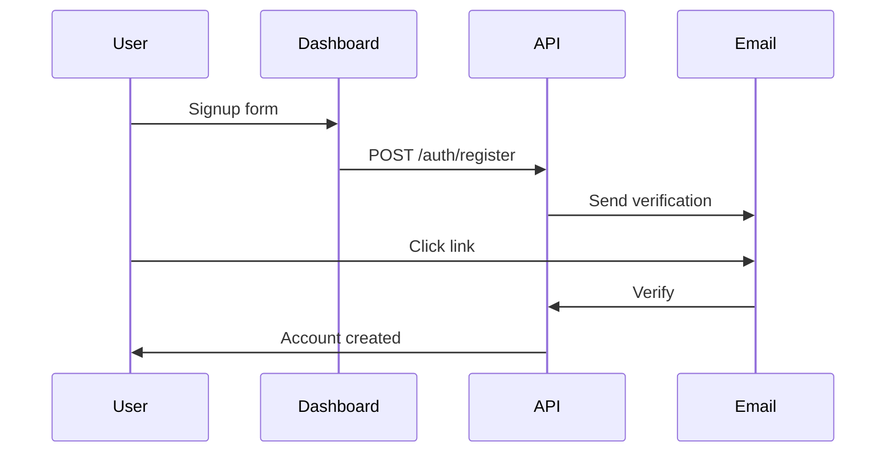

## Overview

CeresLab provides secure authentication to protect your documentation spaces. You manage accounts, roles, and sessions through web interfaces or API endpoints. Follow best practices to ensure secure access.

<Callout kind="alert">
  Always use HTTPS endpoints and store credentials securely. Never expose `YOUR_API_KEY` in client-side code.
</Callout>

## Account Creation

Create accounts via the web dashboard or API. New users start with basic permissions.

<Steps>
  <Step title="Navigate to Signup" icon="user-plus">
    Visit `https://dashboard.example.com/signup`.
  </Step>
  <Step title="Enter Details" icon="edit-3">
    Provide email, username, and a strong password.
  </Step>
  <Step title="Verify Email" icon="mail">
    Check your inbox for a verification link and click it.
  </Step>
  <Step title="API Alternative" icon="api">
````javascript
fetch('https://api.example.com/v1/auth/register', {
  method: 'POST',
  headers: { 'Content-Type': 'application/json' },
  body: JSON.stringify({
    email: 'user@example.com',
    password: 'securepassword123'
  })
});
````
  </Step>
</Steps>



## Login Processes

Log in using web forms, API tokens, or external providers.

<Tabs>
  <Tab title="Web Login" icon="globe">
    Enter credentials at `https://dashboard.example.com/login`.
  </Tab>
  <Tab title="API Login" icon="api">
    <CodeGroup tabs="JavaScript,cURL">
````javascript
const response = await fetch('https://api.example.com/v1/auth/login', {
  method: 'POST',
  headers: { 'Content-Type': 'application/json' },
  body: JSON.stringify({
    email: 'user@example.com',
    password: 'securepassword123'
  })
});
const { token } = await response.json();
````
````bash
curl -X POST https://api.example.com/v1/auth/login \
  -H "Content-Type: application/json" \
  -d '{"email":"user@example.com","password":"securepassword123"}'
````
    </CodeGroup>
  </Tab>
</Tabs>

<ResponseField name="token" field-type="string" required="true">
  JWT access token for API requests. Expires in 24 hours.
</ResponseField>

<ResponseField name="refresh_token" field-type="string" required="false">
  Use to obtain new access tokens.
</ResponseField>

## Role-Based Permissions

Roles control access to documentation features.

<Columns cols={2}>
  <Card title="Viewer" icon="eye">
    Read-only access to public spaces.
  </Card>
  <Card title="Editor" icon="edit-3">
    Edit documents and manage categories.
  </Card>
  <Card title="Admin" icon="shield">
    Full control including user management.
  </Card>
  <Card title="Owner" icon="crown" horizontal>
    Ultimate access to billing and deletion.
  </Card>
</Columns>

Check your role via API:

<ParamField header="Authorization" param-type="string" required="true">
  Bearer `{token}` from login.
</ParamField>

## Password Management

Secure your account with strong passwords and regular updates.

<Expandable title="Reset Password" default-open="true">
  1. Go to `https://dashboard.example.com/forgot-password`.
  2. Enter your email.
  3. Follow the reset link.

  API reset request:
````javascript
fetch('https://api.example.com/v1/auth/reset', {
  method: 'POST',
  body: JSON.stringify({ email: 'user@example.com' })
});
````
</Expandable>

<Callout kind="tip">
  Use passwords with 12+ characters, including uppercase, numbers, and symbols. Enable 2FA where available.
</Callout>

## Session Handling and Logout

Sessions expire after inactivity. Log out explicitly to end sessions.

- Web: Click "Logout" in the dashboard.
- API: Use `DELETE /auth/logout` with your token.

## External Auth Providers

Integrate OAuth for seamless logins.

<Tabs>
  <Tab title="Google OAuth" icon="chrome">
    Redirect to `https://auth.example.com/oauth/google`.
  </Tab>
  <Tab title="GitHub OAuth" icon="github">
    Use client ID `YOUR_CLIENT_ID` and secret `YOUR_CLIENT_SECRET`.
  </Tab>
</Tabs>

<CodeGroup tabs="JavaScript,Python">
````javascript
const url = `https://auth.example.com/oauth/github?client_id=${YOUR_CLIENT_ID}&redirect_uri=${encodeURIComponent('https://dashboard.example.com/callback')}`;
````
````python
import requests
url = f"https://auth.example.com/oauth/github?client_id={YOUR_CLIENT_ID}&redirect_uri=https://dashboard.example.com/callback"
````
</CodeGroup>

## Next Steps

<Columns cols={3}>
  <Card title="Quickstart" icon="zap" href="/quickstart">
    Set up your first documentation space.
  </Card>
  <Card title="Permissions Guide" icon="shield" href="/introduction">
    Learn more about advanced roles.
  </Card>
  <Card title="API Reference" icon="api" href="/changelog">
    Full endpoint details.
  </Card>
</Columns>