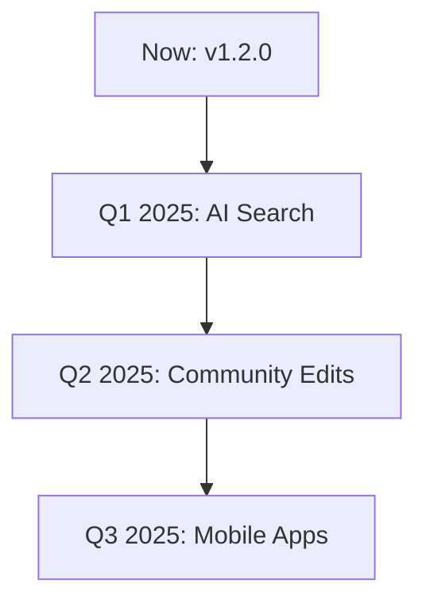

## Recent Updates

<Callout kind="info">
Stay current with CeresLab's evolution. Check this changelog regularly for new perfumery resources, search enhancements, and platform improvements.
</Callout>

<Update label="2024-10-15" description="v1.2.0" tags={["feature", "bugfix", "improvement"]}>

## New Features

- Added advanced search filters for perfumery books and formulas, including aroma profiles and material types.
- Introduced featured materials carousel on the main page with detailed aroma descriptions.
- Enabled category browsing with subcategories for natural extracts and synthetic molecules.

## Improvements

- Enhanced search performance by `>30%` for large formula databases.
- Updated UI with brand color `#3366CC` accents for better navigation.

## Bug Fixes

- Fixed search results pagination issues.
- Resolved mobile responsiveness for material detail pages.

</Update>

<Update label="2024-09-20" description="v1.1.0" tags={["feature", "improvement"]}>

## New Features

- Launched Perfumery Materials Wiki with initial content on key aroma compounds.
- Integrated Humata AI search preview for quick formula lookups.

## Improvements

- Optimized database queries for faster category loading.
- Added keyboard shortcuts for search and navigation.

</Update>

<Update label="2024-08-10" description="v1.0.0" tags={["feature", "breaking"]}>

## New Features

- Core wiki platform with namespaces for Main Page and Discussion.
- Basic search functionality for perfumery books and formulas.
- Account creation and login system.

## Breaking Changes

- Initial schema changes require database migration if upgrading from alpha.

</Update>

## Upgrading to the Latest Version

Follow these steps to upgrade your CeresLab instance safely.

<Steps>
  <Step title="Backup Your Data" icon="database">

    Create a full backup of your wiki content and database.

````bash
pg_dump -U youruser cereslab_db > cereslab_backup.sql
````

  </Step>
  <Step title="Update Dependencies" icon="package">

    Install the latest version using your package manager.

    <CodeGroup tabs="npm,yarn">
````bash
npm install cereslab@latest
````
````bash
yarn add cereslab@latest
````
    </CodeGroup>

  </Step>
  <Step title="Run Migrations" icon="git-branch">

    Execute database migrations.

````bash
npx cereslab migrate
````

  </Step>
  <Step title="Restart Services" icon="refresh-cw">

    Restart your application server.

````bash
pm2 restart cereslab
# or
docker-compose restart
````

  </Step>
</Steps>

<Callout kind="tip">
After upgrading, clear your browser cache and test search functionality with sample perfumery queries.
</Callout>

## Breaking Changes and Migration Notes

For v1.2.0, namespace handling changed. Update your config:

<CodeGroup tabs="JavaScript,Python">
```javascript
// config.js
module.exports = {
  namespaces: ['Main', 'Discussion'],
  searchEnabled: true
};
```
```python
# config.py
NAMESPACES = ['Main', 'Discussion']
SEARCH_ENABLED = True
```
</CodeGroup>

## Upcoming Roadmap

<Columns cols={3}>
  <Card title="AI-Powered Search" icon="zap" href="#ai-search">
    Advanced semantic search for aroma compounds and formulas.
  </Card>
  <Card title="Community Contributions" icon="users" href="#contributions">
    Edit permissions and discussion forums.
  </Card>
  <Card title="Mobile App" icon="smartphone" href="#mobile">
    Native apps for iOS and Android.
  </Card>
</Columns>

<Expandable title="Detailed Roadmap Timeline" default-open="false">



</Expandable>